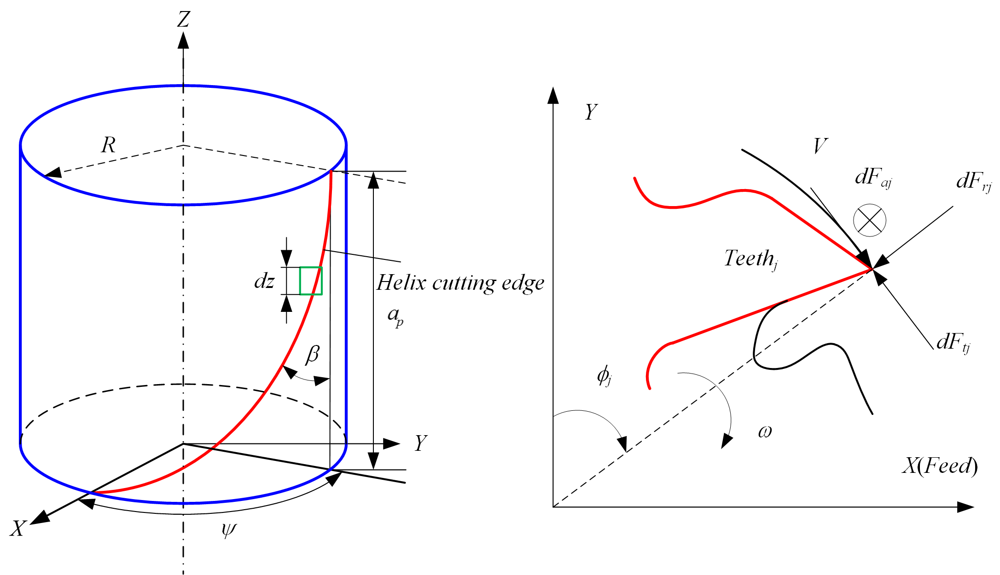

# 平底立铣刀切削力系数辨识
建立了通用切削力模型之后，需要通过实验测定六个切削力系数才能将切削力模型应用到实际切削加工环境中。切削力系数的值在一定程度上反应了切削材料去除过程中的本构关系。

对于同种刀具和被加工材料，切削力系数在一定条件下可看成是常数，它们的测定方法主要步骤是在一定切削条件及切削参数范围内通过正交实验测量出一系列切削力的平均值，然后结合铣削力模型反推求出切削力系数。

具体来说，是<b>保证切入切出角和轴向切削深度不变，采用测力仪测量一组不同的每齿进给量下的切削力，得到每个刀齿周期的平均力</b>。为了避免刀具偏心带来的影响，刀齿周期的平均力由刀具每转一圈得到的总切削力除以刀具的齿数得到，然后通过<b>线性回归</b>的方法确定六个系数。

对于<b>平底立铣刀</b>而言，因为每一刀齿周期的总材料去除量在有螺旋角和没有螺旋角的情况下都相同，因此螺旋角对平均切削力没有影响。

##	平均力计算
对于平底立铣刀而言，根据《Manufacturing Automation》的$P44,(2.89)$，第$j$个刀齿上，高度$z$处的瞬时刚性力模型的基本公式可表示为：

$$\begin{gathered}
  d{F _t}({\phi _j}(z)) = g({\phi _j}(z))[{K _{tc}} \cdot h({\phi _j}(z)) \cdot dz + {K _{te}} \cdot dz] \\\\
  d{F _r}({\phi _j}(z)) = g({\phi _j}(z))[{K _{rc}} \cdot h({\phi _j}(z)) \cdot dz + {K _{re}} \cdot dz] \\\\
  d{F _a}({\phi _j}(z)) = g({\phi _j}(z))[{K _{ac}} \cdot h({\phi _j}(z)) \cdot dz + {K _{ae}} \cdot dz] \\\\
\end{gathered} \tag{1}$$

式中， $dF _t({\phi _j}(z))$,$dF _r({\phi _j}(z))$ ,$dF _a({\phi _j}(z))$ ——分别表示切向、径向和轴向切削力微元，${\phi _j}$可以看做是第$j$齿底部的浸入角，并以此作为参考角度，结合$z$来确定刀齿上其他微元的角度；
$d z$ ,$h({\phi _j}(z))$ ——分别表示切削刃轴向切深微元及切削厚度；
$K _{tc}$ ,$K _{rc}$ ,$K _{ac}$ ——分别表示切向、径向和轴向切削力系数；
$K _{te}$ ,$K _{re}$ ,$K _{ae}$ ——分别表示切向、径向和轴向刃口力系数。
$g({\phi _j}(z))$是根据切入切出角，来判断参与切削与否的二元参数，参与切削时为$1$，不参与切削时为$0$。
另外，需要注意的是，对于某一特定刀具：$\phi _j$其实是时间$t$和高度$z$的函数。

对于平底立铣刀有：
$$ h({\phi _j}(z)) = {f _{t}}\sin {\phi _j}(z) \tag{2}$$
其中，$f _t$为每齿进给量。

<b>图 1.  平底立铣刀切削刃及受力情况 </b> 

根据图1所示几何关系，将$RTC$坐标系下的切削力转化到$XYZ$坐标系下，有：

$$\begin{pmatrix}
  {d{F _{x,j}}({\phi _j}(z))} \\\\
  {d{F _{y,j}}({\phi _j}(z))} \\\\
  {d{F _{z,j}}({\phi _j}(z))}
\end{pmatrix} = \left[ {\begin{array}{c}
  { - \cos {\phi _j}(z)}&{ - \sin {\phi _j}(z) }&{ 0 } \\\\
  {\sin {\phi _j}(z)}&{ - \cos {\phi _j}(z)}&{ 0 } \\\\
  0&{ 0 }&{ -1 }
\end{array}} \right]\begin{pmatrix}
  {d{F _{t,j}}({\phi _j}(z))} \\\\
  {d{F _{r,j}}({\phi _j}(z))} \\\\
  {d{F _{a,j}}({\phi _j}(z))}
\end{pmatrix} \tag{3}$$

那么，由$(1)(2)(3)$，就会有：
$$\begin{array}{c}
d{F _{x,j}}\left( {{\phi _j}\left( z \right)} \right) = g\left( {{\phi _j}\left( z \right)} \right)\left[ \begin{array}{c}
 - \left( {{K _{tc}}{f _t}\sin {\phi _j}\left( z \right) + {K _{te}}} \right)\cos {\phi _j}\left( z \right)\\\\
 - \left( {{K _{rc}}{f _t}\sin {\phi _j}\left( z \right){\rm{ + }}{K _{re}}} \right)\sin {\phi _j}\left( z \right)
\end{array} \right]dz\\\\
{\rm{ = }}g\left( {{\phi _j}\left( z \right)} \right)\left[ \begin{array}{c}
\frac{{{f _t}}}{2}\left( { - {K _{tc}}\sin 2{\phi _j}\left( z \right) - {K _{rc}}\left( {1 - \cos 2{\phi _j}\left( z \right)} \right)} \right)\\\\
 + \left( { - {K _{te}}\cos {\phi _j}\left( z \right) - {K _{re}}\sin {\phi _j}\left( z \right)} \right)
\end{array} \right]dz\\\\
d{F _{y,j}}\left( {{\phi _j}\left( z \right)} \right) = g\left( {{\phi _j}\left( z \right)} \right)\left[ \begin{array}{c}
\left( {{K _{tc}}{f _t}\sin {\phi _j}\left( z \right) + {K _{te}}} \right)\sin {\phi _j}\left( z \right){\kern 1pt} \\\\
 - \left( {{K _{rc}}{f _t}\sin {\phi _j}\left( z \right) + {K _{re}}} \right)\cos {\phi _j}\left( z \right)
\end{array} \right]dz\\\\
{\rm{ = }}g\left( {{\phi _j}\left( z \right)} \right)\left[ \begin{array}{c}
\frac{{{f _t}}}{2}\left( {{K _{tc}}\left( {1 - \cos 2{\phi _j}\left( z \right)} \right) - {K _{rc}}\sin 2{\phi _j}\left( z \right)} \right)\\\\
 + \left( {{K _{te}}\sin {\phi _j}\left( z \right) - {K _{re}}\cos {\phi _j}\left( z \right)} \right)
\end{array} \right]dz\\\\
d{F _{z,j}}\left( {{\phi _j}\left( z \right)} \right) = g\left( {{\phi _j}\left( z \right)} \right)\left[ { - {K _{ac}}{f _t}\sin {\phi _j}\left( z \right) - {K _{ae}}} \right]dz
\end{array}\tag{4}$$

沿轴向积分，可获得作用在刀齿$j$上的切削力在$XYZ$坐标系中的表达式：

$$\begin{pmatrix}
  {{F _{x,j}}({\phi })} \\\\
  {{F _{y,j}}({\phi })} \\\\
  {{F _{z,j}}({\phi })}
\end{pmatrix} = \begin{pmatrix}
  {\int _{z1}^{z2} {d{F _{x,j}}({\phi _j}(z))} } \\\\
  {\int _{z1}^{z2} {d{F _{y,j}}({\phi _j}(z))} } \\\\
  {\int _{z1}^{z2} {d{F _{z,j}}({\phi _j}(z))} }
\end{pmatrix} \tag{5}$$

式中，<b>积分上、下限取决于每个切削刃的接触情况</b>，因此后面的式子中可以将窗函数$g({\phi _j}(z))$略去。对所有刀齿上的切削力求和，可得到铣刀沿进给、法线和轴向3个方向上的切削力。

由式$(5)$知：当 $j=0$ 齿的底部转到某个角度 $\phi$ 时，刀齿$j$上的切削力微元沿着刀齿$j$的切入部分积分可得到刀齿$j$上的总铣削力：

$${F _{q,j} }\left( {{\phi }} \right) = \int _{{z _{j,1}}}^{{z _{j,2}}} {d{F _{q,j}}\left( {\phi _j}(z) \right)dz } ;q = x,y,z\tag{6}$$

<b>需要注意的一点是：</b>在转速一定的情况下，$j=0$ 齿的底部 $\phi$ 必须要在最开始时为 $0$，作为初始位置，并在后面的运动中将其视为参考角度，这样该角度 $\phi $ 就可以完全替代时间变量，所以在上面并没有将时间变量 $t$ 写出来，而是用 $\phi$ 表示刀具转动过程中，当 $j=0$ 齿的底部转到某个角度 $\phi$ 时，每个刀齿所受总切削力的表达式。且其中有关系：

$${\phi _j}(z) = \phi + \sum\limits _{i = 1}^j {{\phi _{p,i}} - \psi (z)} \tag{7}$$

其中，${\phi _{pi}} $ 为齿间角，$\psi (z)$ 为滞后角，与螺旋角有关，对于直柄立铣刀有： $\psi (z)=\frac{2\tan\beta}{D}z$ 。

根据式$(4)(5)$，对于圆柱立铣刀有下式成立：
$$  {F _{x,j}}\left( {{\phi }} \right) = \int _{{z _{j,1}}}^{{z _{j,2}}} {{ \begin{bmatrix}
  \frac{{{f _t}}}{2}\left( { - {K_{tc}}\sin 2{\phi _j}\left( z \right) - {K _{rc}}\left( {1 - \cos 2{\phi _j}\left( z \right)} \right)} \right) \\\\
   + \left( { - {K _{te}}\cos {\phi _j}\left( z \right) - {K _{re}}\sin {\phi _j}\left( z \right)} \right)
  \end{bmatrix}dz} } \\\\
  {F _{y,j}}\left( {{\phi }} \right) = \int _{{z _{j,1}}}^{{z _{j,2}}} {{ \begin{bmatrix}
  \frac{{{f _t}}}{2}\left( {{K _{tc}}\left( {1 - \cos 2{\phi _j}\left( z \right)} \right) - {K _{rc}}\sin 2{\phi _j}\left( z \right)} \right) \\\\
   + \left( {{K _{te}}\sin {\phi _j}\left( z \right) - {K _{re}}\cos {\phi _j}\left( z \right)} \right)
\end{bmatrix}}dz}  \\\\
  {F _{z,j}}\left( {{\phi }} \right) = \int _{{z_{j,1}}}^{{z _{j,2}}} {\left[ { - {K _{ac}}{f _t}\sin {\phi _j}\left( z \right) - {K _{ae}}} \right]dz}  \\\\
\tag{8}$$

当 $j=0$ 齿的底部转到某个角度 $\phi$ 时，该刀具三向所受的总切削力分别为:

$${F_x}\left( \phi  \right) = \sum\limits_{j = 0}^{N - 1} {{F_{x,j}}\left( \phi  \right)} {\kern 1pt};{\kern 1pt}{F_y}\left( \phi  \right) = \sum\limits_{j = 0}^{N - 1} {{F_{y,j}}\left( \phi  \right)} {\kern 1pt};{\kern 1pt}{F_z}\left( \phi  \right) = \sum\limits_{j = 0}^{N - 1} {{F_{z,j}}\left( \phi  \right)} \tag{9}
$$

可以统一写为：

$${F_q}\left( \phi  \right) = \sum\limits_{j = 0}^{N - 1} {{F_{q,j}}\left( \phi  \right)}{\kern 1pt} ;{\kern 1pt} q = x,y,z\tag{10}
$$

为了避免刀具偏心对测量切削力的影响，取一个主轴旋转周期的切削力取和，并将此值除以一个周期时间。

$${\bar F_q} = \frac{1}{T}\int_0^T {{F_q}\left( t  \right)dt} \tag{11}$$

由于 $ \phi=\omega t$ ，所以有： $ d\phi=\omega dt $。 其等价于将 $j=0$ 齿的底部角度 $\phi$ 从 $0$ 到 $2\pi$ 积分，所以式 $(11)$ 可以写为：

$${\bar F_q} = \frac{1}{T\omega}\int_0^{2 \pi} {{F_q}\left( \phi  \right)d\phi} = \frac{1}{2\pi}\int_0^{2 \pi} {{F_q}\left( \phi  \right)d\phi}\tag{12}$$

因为每一刀齿周期的总材料去除量在有螺旋角和没有螺旋角的情况下都相同，因此螺旋角对平均切削力没有影响(或许可以从速度方向上的做功相等解释)。那么就可以看做是<b>没有螺旋角的简单情况</b>，将切削力微元沿着刀具一周积分，并除以齿间角$(\phi _p=2\pi/N)$，得到每齿周期的平均铣削力（由于只有在切入切出角以内才有力的存在，所以相当于仅沿着切出角到切出角积分）：

$$\overline {{F _q}}  =  \frac{1}{{{2\pi}}}\int _{0}^{2\pi} {{F _{q}}\left( \phi  \right)d\phi } =\frac{N}{2\pi}\int _{{\phi _{st}}}^{{\phi _{ex}}} {{F _{q,j}}\left( \phi  \right)d\phi }=\frac{1}{{{\phi _p}}}\int _{{\phi _{st}}}^{{\phi _{ex}}} {{F _{q,j}}\left( \phi  \right)d\phi } {\kern 1pt};{\kern 1pt} q = x,y,z\tag{13}$$

由于看做是直齿，因此有：
	  	(2.4)
	  	(2.5)
	  	(2.6)
	  	(2.7)
同理有：
	  	(2.8)
	  	(2.9)
如果采用“槽铣”进行切削，则有st=0°，ex=180°。式(2.7)、(2.8)和(2.9)可进一步简化为：
	  	(2.10)
	  	(2.11)
	  	(2.12)
##	线性回归法求解切削力系数
由2.1节可知，X、Y、Z三个方向的平均切削力可由每齿进给量的线性方程表示。所以可以用线性回归的方法得到6个未知的切削力系数。三个方向的线性回归方程的形式如下：
	  	(2.13)
其中， 是数据点，一共有n组数据点(n>2); 
a0q代表截距；
a1q代表斜率；
Ei代表测量数据 与 之间的误差。
斜率和截距可以通过最小二乘方法得到[6]，令：
	  	(2.14)
分别对a0q和a1q求偏导，有：
	  	(2.15)
	  	(2.16)
令式(2.15)和(2.16)分别等于零，得a1q和a0q分别为：
	  	(2.17)
	  	(2.18)
为了评估数据拟合的质量，可以计算判定系数r2，其中r为相干系数。r2的值描述了线性回归模型解释原始数据不确定性的程度。
	  	(2.19)
当a0q和a1q都通过对X、Y、Z三个方向的平均力线性回归确定了以后，6个切削力系数可以通过以下公式计算得到：
	  	(2.20)
	  	(2.21)
	  	(2.22)
